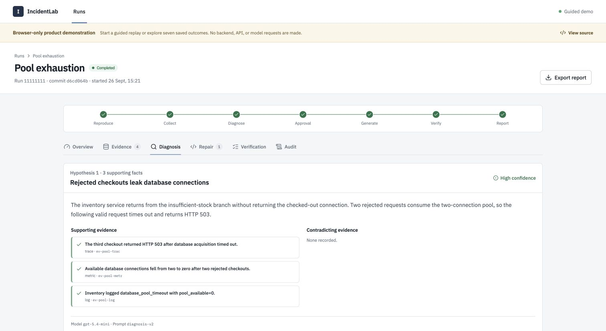
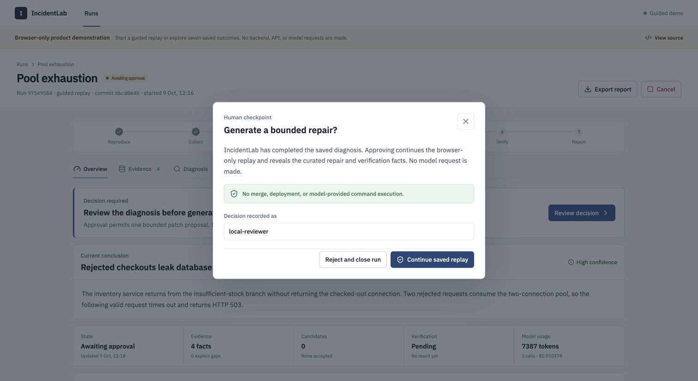

# IncidentLab

[](https://github.com/rajat-blr/incidentlab/actions/workflows/ci.yml)
[](LICENSE)

IncidentLab reproduces controlled service failures, collects traces, metrics,
logs, and pinned source, then uses a model to diagnose the incident and propose
a repair. A reviewer approves repair generation; deterministic policy and an
isolated Docker sandbox decide whether the candidate passes.

**[Explore the demo →](https://incidentlab-flax.vercel.app/runs)**

The browser-only demo needs no account, backend, or API key. The demo dataset
contains **21 saved investigations**: nine curated histories plus all 12 trials
from the latest live-model evaluation, including six successful repairs and six
failures. Four guided replays walk through diagnosis, approval, and verification.
Saved histories include evidence artifacts, model usage, patches where generated,
verification logs, audit events, and downloadable reports.

## Failure scenarios

| Scenario | Fault | Healthy behavior |
| --- | --- | --- |
| Pool exhaustion | Rejected checkouts leak database connections; the next valid request times out. | Reject oversized purchases and preserve capacity for valid requests. |
| Inventory underflow | An oversized purchase commits negative stock. | Reject the purchase without changing inventory. |
| Upstream error masking | The gateway converts an inventory rejection from HTTP 409 to 200. | Preserve the upstream error status and response. |
| Mutation response cache | The gateway caches a purchase POST; a repeated purchase skips inventory. | Execute both purchases; stock moves from 9 to 8. |

These cover inventory and its checkout gateway. Each scenario has fixed
reproduction checks and a bounded repair surface. See [scenario definitions](docs/scenarios.md).

## Review console

Inspect the evidence behind a diagnosis:



Approve repair generation at an explicit checkpoint:



Screenshots show curated guided replays. The saved live-model histories retain
actual recorded outcomes; replaying a scenario in the demo makes no model calls.

## Measured live-model results

Latest batch: **12 trials on 2026-10-09**, three per scenario, using
`gpt-5.4-mini`, `diagnosis-v2`, and `repair-v8`. Source was pinned to
`36a20fd72be99e1ebadad1deee620c311dbbe177` with matching Git HEAD evidence.
Every attempt, including failures, remains in the denominator.

| Scenario | Reproduction | Valid cited diagnosis¹ | Verified repair | Failures |
| --- | ---: | ---: | ---: | ---: |
| Pool exhaustion | 3/3 | 2/3 | 2/3 | 1 |
| Inventory underflow | 3/3 | 2/3 | 2/3 | 1 |
| Upstream error masking | 3/3 | 2/3 | 2/3 | 1 |
| Mutation response cache | 3/3 | 0/3 | 0/3 | 3 |
| **Total** | **12/12 (100%)** | **6/12 (50%)** | **6/12 (50%)** | **6** |

All six successful repairs passed seven mandatory sandbox gates, including
checks preserving the other three inactive faults. The six failures stopped
at diagnosis: three misused gap evidence, and three violated follow-up or
correction-query limits. Evaluation approval was automated.

¹A valid cited diagnosis requires resolving citation IDs, no gap used as
support, and matching artifact SHA-256 hashes. **44/44 emitted citation IDs
resolved**; this checks integrity, not semantic proof of the diagnosis.

[Report and failures](docs/results/live-four-scenarios-matched-head-2026-10-09/summary.md)
· [Raw report](docs/results/live-four-scenarios-matched-head-2026-10-09/report.json)
· [Artifact manifest](docs/results/live-four-scenarios-matched-head-2026-10-09/artifact-manifest.json)
· [Evaluated source archive](docs/results/live-four-scenarios-2026-10-09/source.tar.gz)

Across all historical batches, 36 attempts produced 17 verified repairs and
19 failures, including six authentication failures. Setups differ, so that
aggregate is an audit count. [Evaluation methodology](docs/evaluation.md)
separates historical batches and the offline oracle from live-model results.
These small, controlled trials do not establish performance on unfamiliar services.

## How it works

```text
Reproduce → Collect evidence → Cited diagnosis → Reviewer approval
    → Bounded patch → Repair policy → Sandbox verification → Stored report
```

- **Evidence integrity:** citations resolve to stored artifacts; missing data is
  recorded as a gap. Source context is pinned to an exact Git commit.
- **Approval and policy:** repair generation requires approval. Deterministic
  path, size, secret, syntax, and clean-application checks constrain candidates.
- **Independent verification:** network-disabled, non-root containers run
  baseline reproduction, compilation, static analysis, unit tests, integration
  tests, and repeated incident replay. Results and logs are hash-verified.
- **Durable execution:** Temporal orchestrates retries; PostgreSQL stores run
  state, evidence, decisions, model usage, and audit history.

React/Vite → FastAPI → PostgreSQL + Temporal → OpenAI adapters → trusted verifier.
OpenTelemetry feeds Jaeger, Prometheus, and Loki. Only the separate trusted
verifier receives Docker access; the API and model worker do not.

## Run locally

For the complete workflow, install Docker Desktop with Compose v2 and Git,
and provide an OpenAI API key:

```sh
git clone https://github.com/rajat-blr/incidentlab.git
cd incidentlab
cp .env.example .env
# Set OPENAI_API_KEY in .env; the default model is gpt-5.4-mini.
docker compose up --build -d --wait
```

Open **http://localhost:5173**. Compose builds the application and sandbox,
starts the database, workflow, and telemetry services, and applies migrations.
Keep `.env` private. Commit source changes before starting investigations so
pinned source includes them. If using a source archive, initialize and commit
a Git repository first.

```sh
docker compose logs -f api worker verifier  # Follow execution
docker compose down                       # Stop; preserve database volumes
```

For the browser-only demo, install Node.js 22 and run:

```sh
cd frontend
npm ci
npm run dev:demo -- --port 5176 --strictPort
```

Open **http://localhost:5176**. To run the frontend against the Compose backend
on port 8000, use `npm run dev -- --port 5176 --strictPort` instead.

## Development and repository

CI runs backend lint and tests, PostgreSQL migration checks, the offline
regression evaluation, frontend tests, and live/demo builds without an API key.
The [CI workflow](.github/workflows/ci.yml) and
[container release workflow](.github/workflows/publish-containers.yml) are separate.

| Path | Contents |
| --- | --- |
| `incidentlab/` | API, workflows, persistence, evidence, policy, verification |
| `frontend/` | Review console, guided replays, saved demo dataset |
| `sample_service/`, `scenarios/` | Fault-injected service, public manifests, private evaluation truth |
| `telemetry/`, `migrations/` | Observability configuration and database migrations |
| `scripts/`, `tests/` | Evaluation, demo export, operational tools, backend tests |
| `docs/` | Architecture, controls, evaluation records, setup notes |

To refresh the demo with every trial from a recorded evaluation, including
failures:

```sh
.venv/bin/python scripts/export_demo_runs.py \
  docs/results/live-four-scenarios-matched-head-2026-10-09 --all-trials
```

The exporter checks artifact hashes and fetches missing artifacts from the
recorded API URL. Local PRDs and `work/` scratch files are ignored and untracked.

The optional [GitHub integration](docs/github-integration.md) validates signed
App webhooks and supports separately approved draft PR creation after verified
repair. It requires an installation token and is separate from the demo.

## Scope and further reading

IncidentLab is a portfolio and educational project built around controlled
incidents. The sandbox is not a hardened boundary for arbitrary untrusted
repositories.

[Architecture](docs/architecture.md) · [Threat model](docs/threat-model.md) ·
[Sandbox](docs/sandbox.md) · [Failure modes](docs/failure-modes.md) ·
[Demo walkthrough](docs/demo.md) · [Container releases](docs/container-release.md)

## License

[MIT](LICENSE). Copyright © 2026 Rajat Varma.
