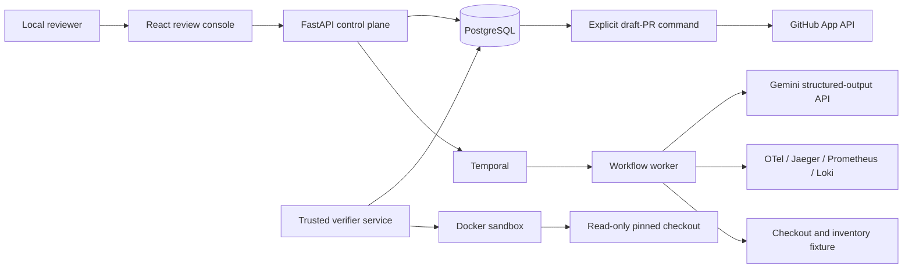

# Architecture and trust boundaries

The browser, API, and worker never receive the Docker socket. The trusted verifier
service is the only component allowed to start a sandbox. It polls durable runs in
`VERIFYING`, records the fixed checks, and signals the waiting Temporal workflow.
The sandbox receives a
read-only candidate workspace, fixed commands, no network, no repository metadata,
and no private evaluation truth.

GitHub is separately opt-in. The normal workflow has no GitHub credentials. The
draft-PR command requires a second recorded approval and an installation token;
its client exposes create/read operations but no merge, deployment, workflow, or
administration operation.

## Data flow

1. A run pins a full Git commit and scenario version.
2. The fixture reproduces an objective failure and emits correlated telemetry.
3. Exact collector responses are hash-addressed before facts are normalized.
4. Gemini receives bounded, redacted facts and must return a strict schema.
5. A reviewer approves or rejects repair generation.
6. Trusted code converts bounded replacements to a diff and applies policy.
7. The verifier service reproduces the baseline and runs fixed checks in Docker.
8. Stored facts—not model confidence—determine outcome and ranking.
9. The UI and exported report expose evidence, uncertainty, checks, and hashes.
